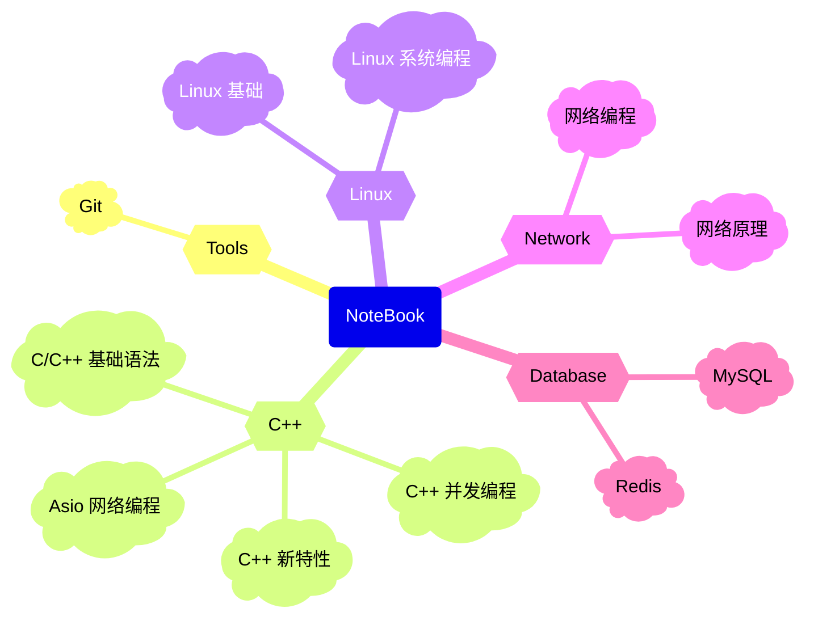

# Jeffery's NoteBook

用 MkDocs 搭的一个比较简单粗糙的博客，使用 Github Page 部署在 Github 上，方便自己日常使用。

**为什么要使用 MkDocs**:

- 使用 Markdown 作为标记语言，虽没有 Sphinx 的 RestructuredText 强大，但容易上手，且对中文较为友好。
- 丰富的 Markdown 扩展，足以满足日常文档需求。
- 配置文件使用 YAML，相比 Sphinx 使用 Python 源码进行配置相对简单。
- 强大的离线搜索功能，以及基本的中文关键词搜索支持。
- 标题 permalink anchor 支持 Unicode 字符（Sphinx 仅支持 ASCII）。

## MkDocs 插件链

本人在使用 MkDocs 时，用到以下几个插件，其中有两个是看到 [TonyCrane](https://note.tonycrane.cc/) 博主的博客后，研究了一下他使用的插件，采用了几个对自己有用的插件（此博主自己实现的插件）。下面是本人用到的插件:

- [mkdocs-material](https://squidfunk.github.io/mkdocs-material/)
- [mkdocs-glightbox](https://github.com/blueswen/mkdocs-glightbox)
- [mkdocs-git-revision-date-localized-plugin](https://github.com/zhaoterryy/mkdocs-git-revision-date-plugin)
- [mkdocs-git-committers-plugin-2](https://github.com/ojacques/mkdocs-git-committers-plugin-2)
- [mkdocs-statistics-plugin](https://github.com/TonyCrane/mkdocs-statistics-plugin/tree/600d5b582bbff1aa209f59cab986b3a6563d470a)
- [mkdocs-changelog-plugin](https://github.com/TonyCrane/mkdocs-changelog-plugin/tree/b90ffb47c85e451dd82ce2b0d8779a0f35bea8a0)
- [jieba](https://github.com/fxsjy/jieba)

## 如何快速使用

MkDocs 工具支持各种插件扩展静态文档，但是这些插件都是基于 Python 语言开发的，因此在安装时尽量做到环境的隔离，避免修改原生的 Python 环境。此处推荐使用 conda 虚拟环境，使用 conda 创建一个服务博客的环境，推荐两个工具 [Mamba](https://mamba.readthedocs.io/en/latest/) 和 [Anaconda](https://www.anaconda.com/)。

- **Mamab**

```bash
mamba create -n mkdocs-env python=3.12
```

- **Anaconda**

```bash
conda create -n mkdocs-env python=3.12
```

环境创建好以后，安装构建博客需要的插件和依赖，通过此项目中的 `requirements.txt` 将所有的插件和依赖自动化安装。

```bash
pip install -r requirements.txt -i https://pypi.tuna.tsinghua.edu.cn/simple
```

可以通过命令 `mkdocs serve` 启动 MkDocs 内置的服务器，可以在浏览器输入 `localhost:8000` 中预览文档。也可以通关命令 `mkodcs build` 编译整个项目，完成博客的构建，在本地生成一个目录保存所有静态文档，直接打开项目中生成的 `site` 目录中的 HTML 文件进行预览。

## 笔记内容


