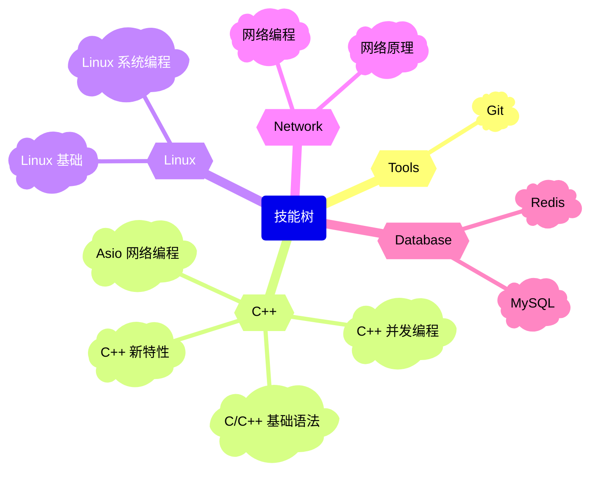

---
hide:
  - toc
  - navigation
icon: material/home
---

<h1 class="title-container">
  Welcome to jeffery's note!
</h1>

```mermaid
mindmap
  root(技能树)
    {{Tools}}
      )Git(
    {{C++}}
      )C/C++ 基础语法(
      )C++ 新特性(
      )C++ 并发编程(
      )Asio 网络编程(
    {{Linux}}
      )Linux 基础(
      )Linux 系统编程(
    {{Network}}
      )网络原理(
      )网络编程(
    {{Database}}
      )Redis(
      )MySQL(
```

 

  [:material-clock-time-two-outline: 最近更新](changelog.html)

